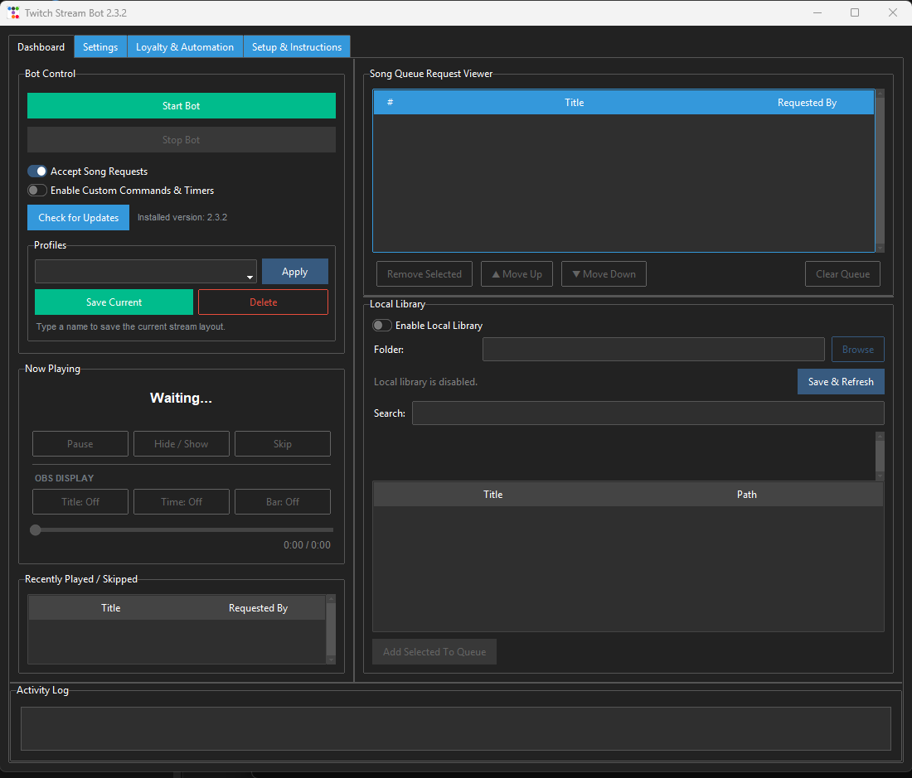

# Twitch Stream Bot

A Windows desktop Twitch bot for song requests, local media playback, loyalty
points, custom commands, timers, and Streamer.bot actions. Media is served to
OBS through a local browser source; users do not need Python, VLC, FFmpeg, or
command-line setup.

[](https://github.com/prophews/Twitch-Stream-Bot/releases/latest)
[](https://github.com/prophews/Twitch-Stream-Bot/actions/workflows/release.yml)

## Install

1. Open the [latest release](https://github.com/prophews/Twitch-Stream-Bot/releases/latest).
2. Download **Twitch.Stream.Bot.Setup.&lt;version&gt;.exe** (not the portable ZIP).
3. Run the installer, then launch **Twitch Stream Bot** from the Start menu.
4. Follow the in-app **Setup & Instructions** tab.

Windows may show a SmartScreen warning because the installer is not
code-signed. Choose **More info**, confirm the publisher/source, then
**Run anyway**.

Already installed? Click **Check for Updates** on the Dashboard. Installing a
new release over the existing one keeps user settings and loyalty data.



## Main Features

- YouTube song requests with fair queueing and automatic temporary-file cleanup
- Local audio/video library playback without copying or deleting original files
- OBS browser-source playback, artwork, title, time, progress bar, hide/show,
  positioning, sizing, and fullscreen controls
- Stream profiles that can be changed from the app or Streamer.bot
- Local loyalty currency, earning rules, gambling, duels, and leaderboards
- Custom commands and timed messages with configurable chat responses
- Direct Streamer.bot action execution through its local HTTP server
- User data stored outside the installation folder in `%LOCALAPPDATA%`
- GitHub-based update checks and reproducible Windows release builds

## Documentation

Read the [graphical user guide](docs/USER_GUIDE.md) for complete setup,
screenshots, command lists, and troubleshooting.

## Privacy

The application does not include the developer's credentials or configuration.
Each installation creates its own settings under:

```text
%LOCALAPPDATA%\Twitch Song Request Bot
```

OAuth tokens, queue state, logs, profiles, and loyalty balances stay on the
user's computer. Do not post `config.json`, the `data` folder, or screenshots
containing an OAuth token.

## Development

```powershell
python -m pip install -r requirements.txt
python -m unittest discover -s tests -v
python run_gui.py
```

Builds are produced by `build_release.ps1`. Pushing a version tag such as
`v2.3.0` runs the GitHub Actions release workflow and attaches the installer
and portable ZIP to a GitHub Release.

## License

Twitch Stream Bot is free to use for personal or commercial livestreaming,
but modification and redistribution are not permitted. See the
[proprietary license](LICENSE) for the complete terms. Earlier copies
received under the MIT License retain the permissions granted with those
copies.
