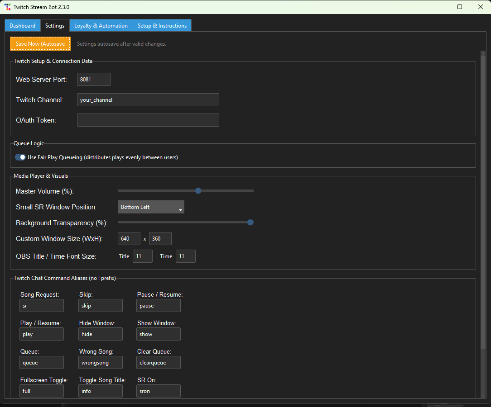
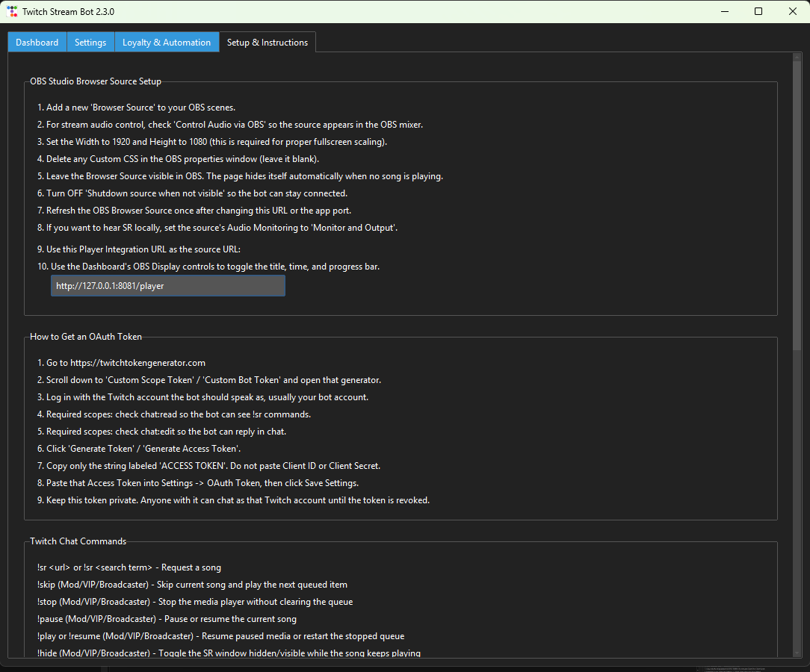
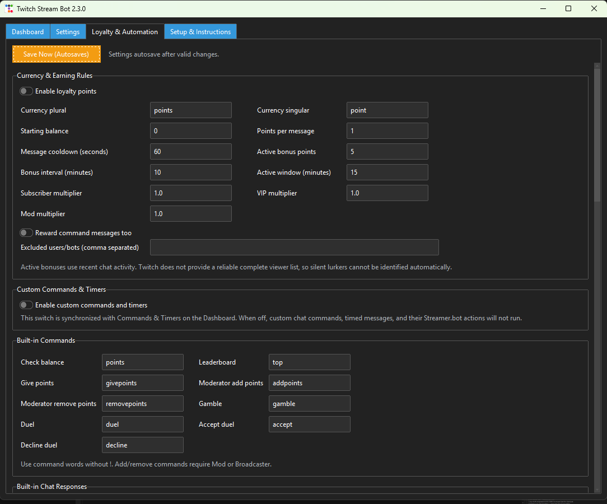

# Twitch Stream Bot User Guide

This guide covers installation, first-time setup, OBS, song requests, local
files, loyalty features, Streamer.bot, updates, and troubleshooting.

## 1. Install or Update

1. Go to the [latest GitHub release](https://github.com/prophews/Twitch-Stream-Bot/releases/latest).
2. Download **Twitch.Stream.Bot.Setup.&lt;version&gt;.exe** (not the portable ZIP).
3. Run the installer.
4. Open **Twitch Stream Bot** from the Start menu.

The installer includes the application, FFmpeg, and every required dependency.
Python and VLC are not required.

If Windows SmartScreen appears, select **More info**, verify that the file came
from this repository's Releases page, and select **Run anyway**. The current
installer is not code-signed.

To update later, click **Check for Updates** on the Dashboard. Download and run
the newer installer over the existing installation. Settings and loyalty data
are stored separately and remain intact.

## 2. Dashboard


The Dashboard contains:

- **Start Bot / Stop Bot**: connects or disconnects the Twitch bot.
- **Accept Song Requests**: enables or disables `!sr`.
- **Enable Custom Commands & Timers**: controls custom automation without
  disabling loyalty commands.
- **Check for Updates**: checks the official GitHub Releases page.
- **Profiles**: saves and switches complete non-secret stream configurations.
- **Now Playing**: play/pause, hide/show, skip, overlay controls, and seeking.
- **Song Queue Request Viewer**: reorder or remove queued media.
- **Local Library**: scan, search, and queue files from one local folder.
- **Activity Log**: connection, playback, download, cleanup, and error details.

The Activity Log divider can be dragged if more or less log space is desired.

## 3. Twitch Connection



### Create the token

1. Open [Twitch Token Generator](https://twitchtokengenerator.com/).
2. Choose **Custom Scope Token** or **Custom Bot Token**.
3. Log in as the Twitch account that should speak as the bot.
4. Enable `chat:read`.
5. Enable `chat:edit`.
6. Generate the token.
7. Copy only the value labeled **ACCESS TOKEN**.

Do not use the Client ID or Client Secret. Keep the access token private.

### Enter settings

1. Open **Settings**.
2. Enter the channel name without `https://twitch.tv/`.
3. Paste the access token into **OAuth Token**.
4. Leave the web server port at `8081` unless another application uses it.
5. Wait for autosave or click **Save Now (Autosaves)**.
6. Return to the Dashboard and click **Start Bot**.

The Activity Log should show a successful Twitch login and the local player URL.

## 4. OBS Browser Source

1. Start the bot once so its local web server is running.
2. In OBS, add a **Browser Source**.
3. Set its URL to `http://127.0.0.1:8081/player`.
4. Set Width to `1920` and Height to `1080`.
5. Remove all Custom CSS from the Browser Source.
6. Enable **Control Audio via OBS**.
7. Turn off **Shutdown source when not visible**.
8. Leave the OBS source visible. The page itself hides when no media is active.
9. Refresh the Browser Source once after changing its URL or the bot's port.

To hear playback through the computer as well as the stream, open OBS
**Advanced Audio Properties** and set the Browser Source to
**Monitor and Output**. If only stream output is required, audio monitoring can
remain off.



## 5. Song Requests and Playback

Default chat commands:

| Command | Purpose |
| --- | --- |
| `!sr <search or YouTube URL>` | Add a song request |
| `!queue` | Show now playing and upcoming requests |
| `!wrongsong` | Remove the user's most recent request |
| `!skip` | Skip the current media |
| `!stop` | Stop playback without clearing the queue |
| `!pause` | Pause or resume |
| `!play` / `!resume` | Resume or restart a stopped queue |
| `!hide` | Toggle the media window while audio continues |
| `!show` | Show the media window |
| `!full` | Toggle fullscreen media |
| `!info` | Toggle the song title |
| `!clearqueue` | Clear the queue |

Command words can be changed under **Settings**. Moderator/VIP/Broadcaster
permissions are shown in the in-app **Setup & Instructions** tab.

Downloaded request files are stored temporarily under the application's local
data folder and removed after playback. If OBS still has a file locked, cleanup
retries in the background and again at startup.

## 6. Local Media Library

1. On the Dashboard, enable **Local Library**.
2. Click **Browse** and choose one root folder.
3. Click **Save & Refresh**.
4. Search or select one or more files.
5. Click **Add Selected To Queue**.

The folder is scanned recursively for supported audio and video formats.
Embedded audio artwork is displayed when available. Local files use the same
queue and controls as downloaded requests.

Original local-library files are never copied into `temp_sr` and are never
deleted by cleanup.

## 7. Loyalty, Games, Commands, and Timers



Open **Loyalty & Automation** to configure:

- Currency singular/plural names and starting balance
- Points per message and active-chat bonuses
- Subscriber, VIP, and moderator multipliers
- Excluded bot/user names
- Editable built-in command names and chat responses
- Gambling limits, odds, payouts, and cooldowns
- Duel limits, timeout, and cooldown
- Custom commands with permissions, costs, cooldowns, responses, and actions
- Timed chat messages and optional Streamer.bot actions
- Streamer-started raffles with announcements, reminders, winner drawing, and optional currency rewards

Common built-in commands are `!points`, `!top`, `!givepoints`, `!gamble`,
`!duel`, `!accept`, `!decline`, and `!raffle`. Moderator adjustment commands
default to `!addpoints` and `!removepoints`.

Raffles are started from the **Raffle Control** section in the app, not by
viewers in chat. Viewers use the configured raffle entry command only while a
raffle is active. Duplicate entries are ignored.

Custom commands include a **Public list description** field. Use that field for
viewer-facing redeem descriptions instead of putting local file paths or private
Streamer.bot action names in a public page.

Loyalty balances are stored locally in:

```text
%LOCALAPPDATA%\Twitch Song Request Bot\data\loyalty.sqlite3
```

Use the built-in backup and restore controls before moving to another computer.

## 8. Public Command List

While the bot is running, open:

```text
http://127.0.0.1:8081/commands
```

Change `8081` if your app uses a different web server port.

The command list page shows viewer-facing song request commands, loyalty/game
commands, raffle entry details, and enabled custom commands. It intentionally
does not expose OAuth tokens, local media paths, database paths, Streamer.bot
URLs, Streamer.bot action IDs, logs, or private config files.

## 9. Streamer.bot Integration

Streamer.bot remains an independent automation application. This bot can call a
selected Streamer.bot action when a custom command or timer runs.

1. Open Streamer.bot.
2. Enable its HTTP Server under **Servers/Clients**.
3. Use host `127.0.0.1` and port `7474`.
4. In this app, open **Loyalty & Automation**.
5. Enable **Allow custom commands to execute Streamer.bot actions**.
6. Keep the URL as `http://127.0.0.1:7474/DoAction`.
7. Click **Refresh Actions**.
8. Select an action in a custom command or timer.
9. Use **Test Selected Action** before testing in Twitch chat.

No Streamer.bot trigger is required; this app directly calls the selected
action. Stopping this Twitch bot prevents its pending timers/actions from
dispatching, but independent Streamer.bot triggers continue normally.

Streamer.bot can apply saved profiles through:

```text
http://127.0.0.1:8081/api/profiles/apply?name=PROFILE_NAME
```

Use a Streamer.bot **Core → Network → Fetch URL** sub-action. Replace spaces in
profile names with `%20`.

## 10. Profiles

Profiles capture all non-secret modifiable settings, including:

- Song-request layout and display settings
- Local-library selection
- Loyalty and game rules
- Built-in/custom commands and responses
- Timed messages
- Streamer.bot integration settings

OAuth tokens, OBS WebSocket passwords, databases, queue state, and runtime paths
are excluded.

Type a profile name on the Dashboard and click **Save Current**. Select it and
click **Apply** to switch configurations.

## 11. User Data and Privacy

Installed application files are separate from personal data. User data is kept
in:

```text
%LOCALAPPDATA%\Twitch Song Request Bot
```

This includes the OAuth token, settings, profiles, logs, queue state, and
loyalty database. Uninstalling the program does not automatically delete this
folder, which allows settings to survive reinstalling or updating.

Never share `config.json` or an OAuth token publicly. The GitHub release ZIP and
installer are automatically checked to exclude runtime configuration and media.

## 12. Troubleshooting

### Commands do nothing

- Confirm the Activity Log says Twitch login succeeded.
- Confirm the channel name is correct.
- Regenerate a token with both `chat:read` and `chat:edit`.
- Confirm **Accept Song Requests** or **Enable Custom Commands & Timers** is on,
  depending on the command.

### OBS shows or hears nothing

- Start the bot before testing the browser source.
- Confirm the URL and port match the app.
- Leave the source visible and disable **Shutdown source when not visible**.
- Refresh the Browser Source once after changing the URL or port.
- Use **Monitor and Output** if local monitoring is desired.

### YouTube downloads stop working

Install the newest release from GitHub. Releases bundle the current tested
`yt-dlp` version and FFmpeg.

### Streamer.bot says the action is unavailable

- Enable Streamer.bot's HTTP server.
- Enable action execution in this app.
- Confirm both applications are on the same computer.
- Refresh actions and test the selected action.

### Port 8081 is already in use

Change **Web Server Port** under Settings, save, restart the bot, and update the
OBS Browser Source URL to match.

## 13. Getting Help

Open a [GitHub issue](https://github.com/prophews/Twitch-Stream-Bot/issues) and
include the relevant Activity Log lines. Remove OAuth tokens, usernames,
personal file paths, and private media names before posting.
